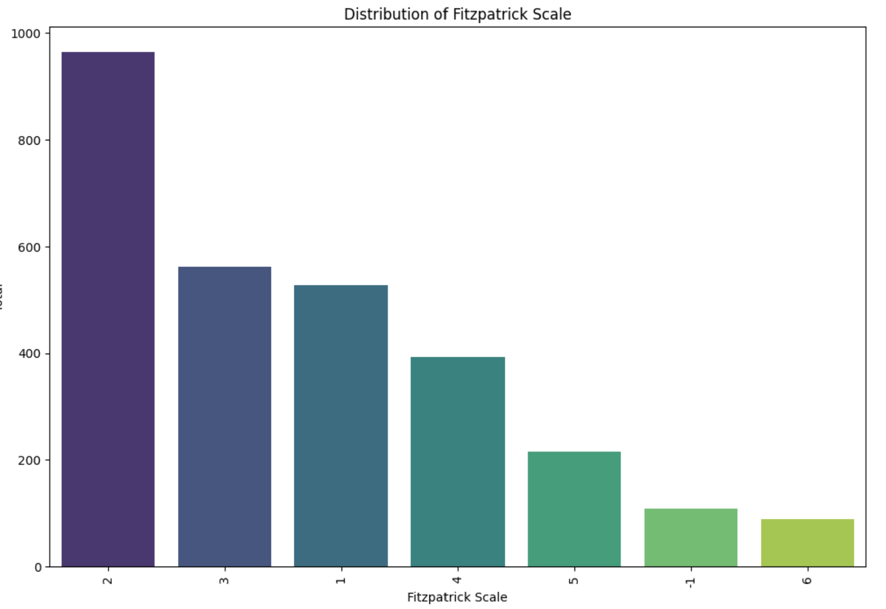
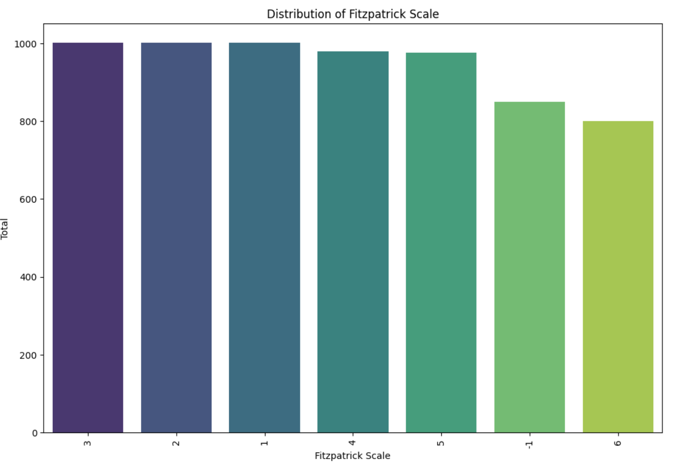

# Kaggle-Collagen

### **👥 Team Members**

| Name | GitHub Handle | Contribution |
| ----- | ----- | ----- |
| Yomna Elmousalami | @YomnaElmousalami | Handled Data Preprocessing and assisted in model finetuning. |
| Uma Manicka | @MelRam | Led EDA, visualized dataset distributions, handled missing data. |
| Ananya Jakilati | @anujakilati | Data Modeling, Data Pre-processing, Image Classification research. |
| Ilayda Dogan | @CharlieN | Assisted in Data Visualizations and Data preprocessing techniques.|
| Vivian Zheng | @CharlieN | Assisted in Data Visualizations and Data preprocessing techniques. |

---

## **🎯 Project Highlights**

* Built an Xception model using transfer learning and data augmentation to solve the issue of classifying different dermatological skin conditions across different skin tones.
* Implemented random oversampling, data augmentation, and histogram equalization to optimize results within compute constraints.

🔗 [Equitable AI for Dermatology | Kaggle Competition Page](https://www.kaggle.com/competitions/bttai-ajl-2025/overview)

---

## **👩🏽‍💻 Setup & Execution**

**To use this reposiory, you:**
- git clone https://github.com/anujakilati/Kaggle-Collagen.git and cd into Kaggle-Collagen

## **🏗️ Project Overview**

* The project was a part of the Kaggle Competition for the Break Through Tech AI fellowship program. The goal of this project was to classify different dermatlogical skin conditions across different skin tones, since there is a lack of representation in training data for minority populations. 

---

## **📊 Data Exploration**

* The dataset that was utilized was a subset of the FitzPatrick17k dataset, a labeled collection of about 17,000 images depicting a variety of serious (e.g., melanoma) and cosmetic (e.g., acne) dermatological conditions with a range of skin tones scored on the FitzPatrick skin tone scale (FST). About 4500 images are in this set, representing 21 skin conditions out of the 100+ in the full FitzPatrick set.
* More specifically, the dataset includes the following:
  - images.zip - An archive file containing the images. The directory is further divided into a train and a test directory. Train is further divided into directories according to the image's label. Test is unlabeled and the source of images for making the submission.
  - train.csv - Full metadata about the images
  - test.csv - The images against which you will make predictions; contains metadata but no 'label' column
  - sample_submission.csv - A sample submission file in the correct format.
* Data exploration was conducted by first checking if there are null values or outliers in the dataset, and handling those values. Afterwards, the goal was to see if there were any features in the dataset that were imbalanced. Some of the features that were explored include the Distribution of values in the fitzpatrick scale as well as the distribution of the different types of skin conditions present. However, we decided to conduct random oversampling based on fitzpatrick scale so minority skin tone data is more prevelant in the dataset, as seen in ***Figure 1*** and ***Figure 2***. Afterwards, we decided to encode the label with label encoder to convert categorical data into numerical form so that machine learning models can process them later on.
* After the initial data exploration, the next step of the process was to conduct some data preprocessing. Some of the approaches we tried was data augmentation, histogram equalization, and contrast stretching for the image data. The goal of this step was to increase the diversity of the training dataset and enhance image contrast for better feature visibility especially in areas where details might have been lost due to poor lighting or contrast.
* Some of the challenges encountered with dataset is the fact that there is a lack of representation of certan skin tones. Thus, the goal of the data exploration and preprocessing steps were to make sure that the data was a little bit more balanced. Another challenge with the dataset was making sure not to apply to much or too little data augmentation, which could lower the accuracy and f1 score of the model. 

**Potential visualizations to include:**

***Figure 1: The dataset distribution prior to applying Fitzpatrick Scale Oversampling***

***Figure 2: The dataset after applying Fitzpatrick Scale Oversampling***
---

## **🧠 Model Development**

**Describe (as applicable):**

* Model(s) used (e.g., CNN with transfer learning, regression models)
* Feature selection and Hyperparameter tuning strategies
* Training setup (e.g., % of data for training/validation, evaluation metric, baseline performance)

---

## **📈 Results & Key Findings**

**Describe (as applicable):**

* Performance metrics (e.g., Kaggle Leaderboard score, F1-score)
* How your model performed overall
* How your model performed across different skin tones (AJL)
* Insights from evaluating model fairness (AJL)

**Potential visualizations to include:**

* Confusion matrix, precision-recall curve, feature importance plot, prediction distribution, outputs from fairness or explainability tools

---

## **🖼️ Impact Narrative**

**AJL challenge:**

As Dr. Randi mentioned in her challenge overview, “Through poetry, art, and storytelling, you can reach others who might not know enough to understand what’s happening with the machine learning model or data visualizations, but might still be heavily impacted by this kind of work.”
As you answer the questions below, consider using not only text, but also illustrations, annotated visualizations, poetry, or other creative techniques to make your work accessible to a wider audience.
Check out [this guide](https://drive.google.com/file/d/1kYKaVNR\_l7Abx2kebs3AdDi6TlPviC3q/view) from the Algorithmic Justice League for inspiration!

1. What steps did you take to address [model fairness](https://haas.berkeley.edu/wp-content/uploads/What-is-fairness_-EGAL2.pdf)? (e.g., leveraging data augmentation techniques to account for training dataset imbalances; using a validation set to assess model performance across different skin tones)
2. What broader impact could your work have?

---

## **🚀 Next Steps & Future Improvements**

**Address the following:**

* What are some of the limitations of your model?
* What would you do differently with more time/resources?
* What additional datasets or techniques would you explore?

---

## **📄 References & Additional Resources**

* Cite any relevant papers, articles, or tools used in your project

